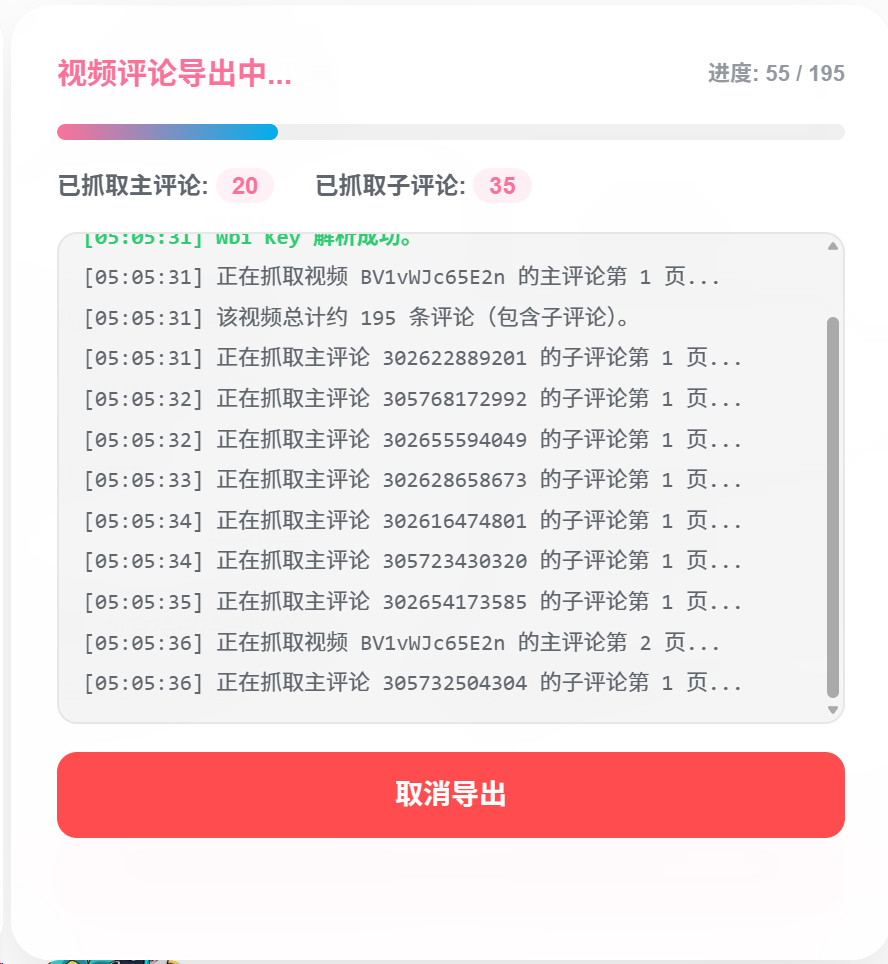
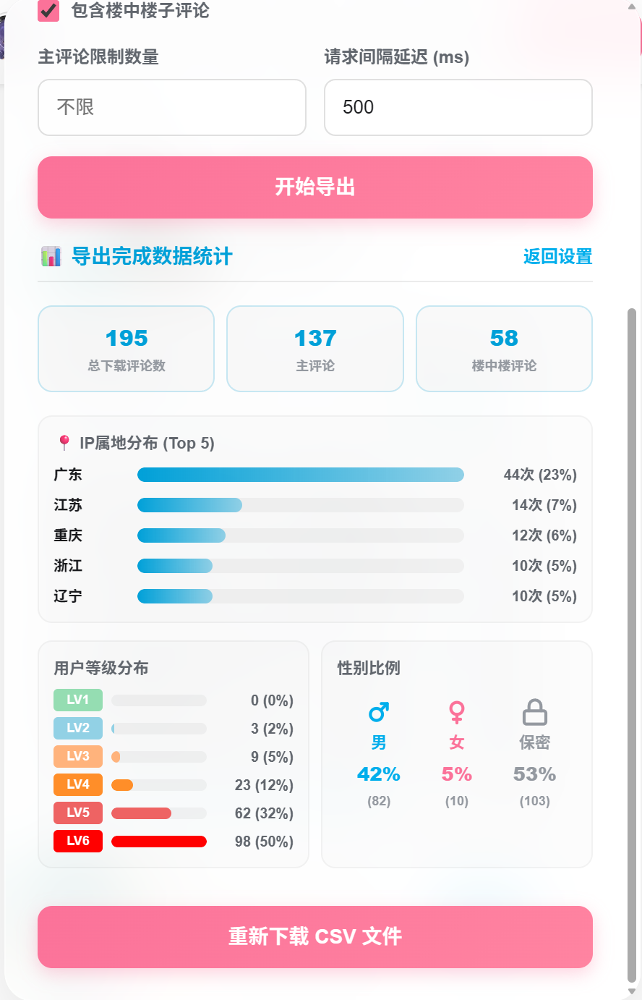

# Bilibili Comment Exporter (bilibili-comment-exporter)

一款运行于浏览器环境的哔哩哔哩（B站）视频评论区导出油猴脚本（Tampermonkey UserScript）。该工具完全移植并适配了由 [WShihan](https://github.com/WShihan) 编写的基于 Go 语言的命令行评论下载工具 [blblcd](https://github.com/WShihan/blblcd) 的核心功能，并在此之上提供了极具现代视觉美感的控制面板及数据统计图表。

[    ](https://github.com/heroxv/bilibili-comment-exporter)

---

### 🔗 关联项目：blblcd (Go 语言命令行下载工具)

本项目移植自下述项目的核心 API 与 CSV 数据结构定义：

*   **blblcd (Bilibili Comment Downloader)**：一款基于 [bilibili-API-collect](https://github.com/SocialSisterYi/bilibili-API-collect) 的B站视频评论下载命令行工具。
*   🗂️ 仓库： [Codeberg](https://codeberg.org/wsh233/blblcd) | [GitHub](https://github.com/WShihan/blblcd)
*   🎉 支持跨平台（Mac/Linux/Windows），可高效、快速地在终端下载并进行各种本地映射与统计。

## 🌟 项目特点

*   **全数据抓取**：支持导出视频下所有的主评论，以及评论下的楼中楼（子评论）。
*   **Wbi 鉴权签名**：脚本内建 Wbi 接口签名机制，自动获取 img_key 和 sub_key 完成签名，避免 API 请求返回 -403 受限。
*   **批量导出**：支持在 UP 主个人空间页（`space.bilibili.com`）一键批量抓取该 UP 主的投稿视频评论。
*   **Excel 兼容**：导出的 CSV 文件默认添加 UTF-8 BOM 编码头，彻底杜绝使用 Microsoft Excel/WPS 打开中文评论时出现的乱码问题。
*   **实时数据看板**：完成导出后，在页面内直接渲染可视化的数据分析统计：
    *   📍 **IP 属地分布** (Top 5 柱状图)
    *   📈 **用户等级分布** (LV1 - LV6 比例)
    *   👫 **用户性别比例** (男/女/保密 百分比)
*   **高级玻璃质感 UI**：精致的高斯模糊背景设计，搭配流畅的动画交互，提供卓越的用户体验。

---

## 🎨 界面效果预览

| 展开控制面板 | 导出数据进行中 |
| :---: | :---: |
|  |  |

| 实时数据看板 | 页面悬浮按钮 |
| :---: | :---: |
|  |  |

---

## 📂 项目结构

```text
bilibili-comment-exporter/
├── assets/
│   ├── logo.svg                         # 脚本标志图标 (Logo)
│   ├── 导出中.png                       # 导出评论数据中界面
│   ├── 导出评论按钮.png                 # 页面右下角悬浮按钮
│   ├── 统计页面.png                     # 数据可视化分析面板
│   └── 设置.png                         # 导出参数配置面板
├── bilibili_comment_exporter.user.js    # 油猴脚本核心源文件
├── LICENSE                              # MIT 开源许可证
└── README.md                            # 项目说明文档
```

---

## 🚀 安装指南

### 1. 准备工作
确保您的浏览器已安装了用户脚本管理器插件：
*   [Tampermonkey (油猴)](https://www.tampermonkey.net/) (强烈推荐)
*   [Violentmonkey (暴力猴)](https://violentmonkey.github.io/)

### 2. 安装脚本
1.  复制本项目中的 [bilibili_comment_exporter.user.js](./bilibili_comment_exporter.user.js) 文件的全部代码。
2.  点击浏览器右上角油猴图标 -> **添加新脚本**。
3.  清除编辑器中的默认模版代码，粘贴刚才复制的内容。
4.  按下 `Ctrl + S`（或点击左上角 文件 -> 保存）即可完成安装。

---

## 🛠️ 使用说明

### 视频评论导出
1.  打开任意 B站视频播放页面（例如：`https://www.bilibili.com/video/BV...`）。
2.  页面右下角会出现悬浮的 **"导出评论"** 按钮，点击即可展开控制面板。
3.  脚本会自动提取并填入当前视频的 BVID。
4.  在面板中按需配置：
    *   **排序方式**：按热度优先或最新时间优先。
    *   **楼中楼**：是否抓取子评论。
    *   **数量限制**：设置最大抓取主评论数量（留空表示抓取全部）。
    *   **请求延迟**：默认 500 毫秒，调大可以降低触发防爬策略的风险。
5.  点击 **"开始导出"**。导出过程中可在控制台区域实时查看进度和日志。
6.  抓取完成后，浏览器会自动触发 CSV 文件下载。

### UP 主视频批量导出
1.  进入任意 B站 UP 主的空间首页（例如：`https://space.bilibili.com/...`）。
2.  点击 **"导出评论"** 按钮展面板，选择 **"UP主批量"** 选项卡。
3.  脚本会自动提取当前 UP 主的 Mid。
4.  配置批量抓取的视频页数（默认 3 页，每页包含 30 个视频）以及其他过滤条件。
5.  点击 **"开始批量导出"**，脚本将依次迭代视频下载评论，并最终合并为一个 CSV 文件保存。

---

## 📊 导出字段说明

导出的 CSV 文件字段与命令行版 `blblcd` 保持一致：

| 字段名称 | 说明 | 示例 |
| :--- | :--- | :--- |
| **bvid** | 视频 BV 号 | BV1e7NRemEwv |
| **upname** | 评论发送者用户名 | 用户A |
| **sex** | 发送者性别 | 男 / 女 / 保密 |
| **content** | 评论正文 | 精彩的视频！ |
| **pictures** | 评论中附带的图片 URL | 图片链接 (若有多张用分号分隔) |
| **rpid** | 当前评论 ID | 243795113873 |
| **oid** | 视频的 AVID (十进制数字) | 113976755094913 |
| **mid** | 评论发送者的用户 UID | 123456 |
| **parent** | 父评论 ID | 若是一级评论则为 0，若是回复则为被回复评论的 ID |
| **fans_grade** | 粉丝标签等级 | 0 (无) 或大于 0 对应粉丝牌级数 |
| **ctime** | 评论发布时间戳 (秒) | 1718314584 |
| **like** | 评论获赞数 | 256 |
| **level** | 发送者的当前 B站等级 | 5 (表示 LV5) |
| **location** | 发送者 IP 归属地 | 北京 |

---

## 📝 更新日志

### v0.2.0 (2026-06-17)

*   🛡️ **网络健壮性**：所有 API 请求新增 15s 超时保护和自动重试机制（最多 3 次，指数退避），避免偶发网络波动导致导出中断。
*   ⚡ **Wbi Key 缓存**：缓存已获取的 Wbi 签名密钥（5 分钟有效期），批量导出时不再每个视频重复请求。
*   🚀 **性能优化**：CSV 构建改用数组拼接，进度 DOM 更新改为 500ms 节流，大规模数据导出时页面更流畅。
*   📊 **导出耗时显示**：完成导出后在看板顶部展示总耗时。
*   🔔 **桌面通知**：导出完成后发送浏览器通知，便于长时间导出时切换标签页。
*   ✂️ **拖拽面板**：控制面板现可通过拖拽标题栏自由移动到屏幕任意位置。
*   🛡️ **防重复点击**：导出进行中禁用导出按钮，防止并发触发。
*   🧹 **代码整洁**：简化 `@match` 规则、修复 `URL.revokeObjectURL` 安全时序、rpid 类型安全。

---

## ⚖️ 免责声明

1.  本项目代码仅供个人学习、研究和交流使用，请勿用于商业及非法用途。
2.  在使用本工具时，请遵守哔哩哔哩（Bilibili）相关用户协议及法律法规，因滥用工具导致账号被封禁或由此产生的其他后果由使用者自行承担。
